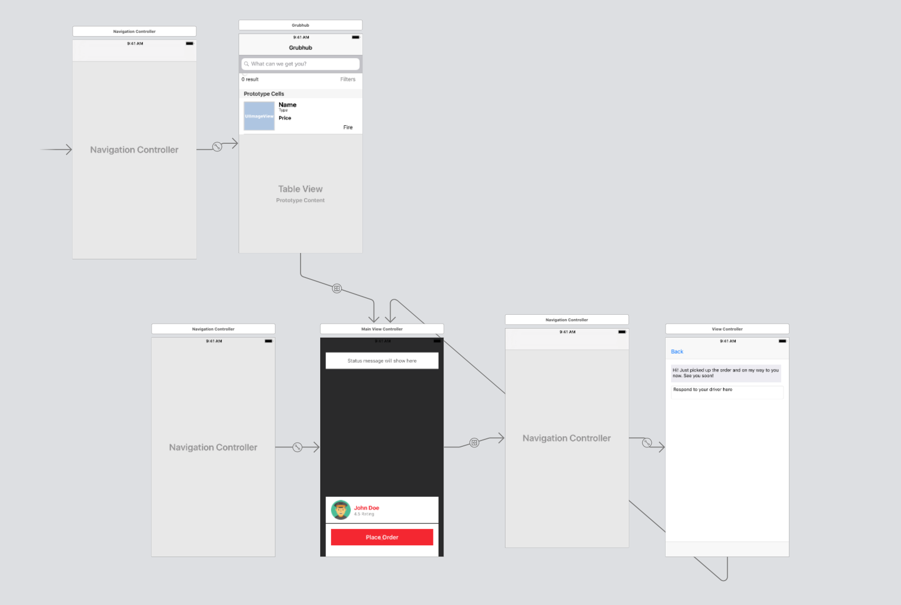

# Grubhub sample iOS App

## Purpose
To demonstrate the functionality of Pusher for Grubhub

## Storyboard

## Notes
- MVP for demonstation purposes
- Relies on [this backend](https://github.com/zasmail/grubhub_backend) which is currently hosted on Heroku
- Relies on Algolia to render options. Orders are automated by the backend and streamed using Pusher. When a new order is created, Algolia will re-index the dish which was just ordered. If a dish was ordered in the last hour, it will be have a "🔥 🔥" designation in the app. If it was ordered in the last day, but not the last hour, it will have this "🔥" designation. Dishes which have been ordered more recently will be shown before dishes which have not been. 
- Backend fakes a delivery and uses Pusher to update the delivery driver's location
- The chat is faked and can be seen live [here](https://mysterious-woodland-40384.herokuapp.com/) with [this repo for the react frontend](https://github.com/zasmail/grubhub_chat) and [this for the node backend](https://github.com/zasmail/grubhub_chat_server)
[real chat](RiderClient/Resources/Assets.xcassets/ezgif.com-video-to-gif.gif)

